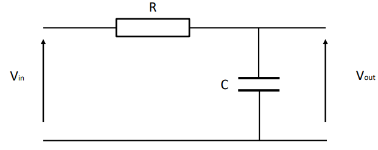
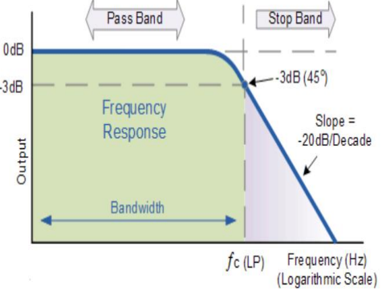
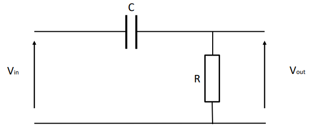
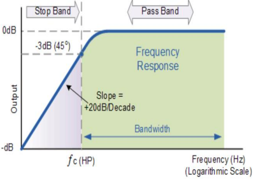
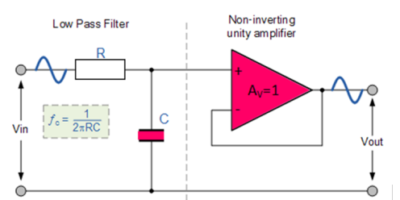
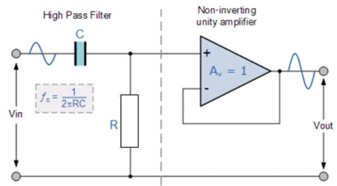

# Filters

Filters are often required when designing electronic circuits in order to limit or restrict the bandwidth of signals applied to particular components. For example, the Analogue Input of a microcontroller is very sensitive to electrical noise and so it is desirable that this noise be removed before the measurement signal is applied to the input.

Typically, we want to either limit the high frequencies, from noise for example, from being applied to the input of a device or in some cases reduce the low frequency ‘hum’ from a devices input.

In order to limit the high frequency signals we can use a Low Pass Filter and to reduce any low frequency ‘hum’ we can use a High Pass Filter

## Low Pass 1st Order Filter:

The Cutoff frequency (fc) is frequency at which the output signal attenuates often referred to as the -3dB point.

\\[fc = \frac{1}{2\pi RC}\\]

Fig 1. Low Pass 1st Order Filter

## Lowpass 1st Order filter frequency response:

The Cutoff frequency (fc) is frequency at which the output signal attenuates often 
referred to as the -3dB point.

The filter attenuates the signal at a rate of -20dB/decade of frequency

Fig 2. Low Pass 1st Order Filter Frequency Response 

In this example all frequencies above fc will be attenuated.

## High Pass 1st Order Filter:

The Cutoff frequency (fc) is frequency at which the output signal increases often referred to as the 3dB point.

\\[fc = \frac{1}{2\pi RC}\\]

Fig 3. High Pass 1st Order Filter

## Highpass 1st Order filter frequency response:

The Cutoff frequency (fc) is the frequency at which the output  signal is passed ften referred to as the -3dB point

\\[fc = \frac{1}{2\pi RC}\\]

The filter increases the signal at a rate of 20dB/decade of frequency

Fig 4. High Pass 1st Order Filter Frequency Response 

In this example all frequencies above fc will pass.

## Low Pass Active 1 st Order Filter:

In order to stop the filter section loading any circuitry an active lowpass filter can be used. A non-inverting unity gain opamp is used as the buffer section.

\\[fc = \frac{1}{2\pi RC}\\]

Fig 5. Low Pass 1st Order Active  Filter

## High Pass Active 1st Order Filter:

In order to stop the filter section loading any circuitry an active highpass filter can be used. A non-inverting unity gain opamp is used as the buffer section.

\\[fc = \frac{1}{2\pi RC}\\]

Fig 5. High Pass 1st Order Active  Filter

## Example:

A filter is required in order to reduce the high frequency noise at the analogue input of a microcontroller. It is required that all frequencies above 200Hz should be attenuated by a minimum of 20dB per decade of frequency.

Reducing the high frequency noise and 20dB/decade attenuation implies a first order lowpass filter.

Using the given equation and selecting R = 1k, C must be equal to 795nF to give a cut-off frequency of 200Hz

\\[fc = \frac{1}{2\pi RC}\\]