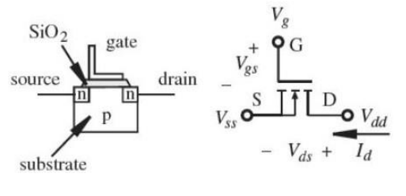
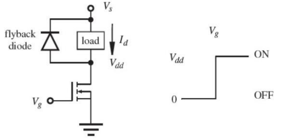
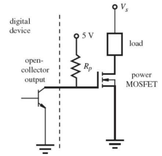
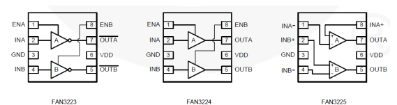

# MOSFETS and MOSFET Drivers

##  Metal Oxide Field Effect Transistor (MOSFETs)
- MOSFETs are similar in appearance to BJT’s however their operation is completely different.

- BJT’s are current activated devices whereas MOSFETS are voltage activated

Fig. 1 n-channel enhancement-mode MOSFET

- In order to switch on a enhancement-mode MOSFET the gate to source voltage must be greater than or equal to the drain voltage once the devices threshold voltage has been exceeded.

- For the MOSFET to be switched on:

\\[V_{gs} - V_{t} \ge V_{dd} \\]

Where \\(V_t\\) is the devices threshold voltage typically 2V

## MOSFET applications

- MOSFETS are typically used to switch power to a load, for example 
switching on a motor from a microcontroller.

Fig 2. The MOSFET will switch on when \\(V_{gs} - V_{t} \ge V_{dd}\\)

- Driving a MOSFET from an open collector digital device

Fig 3. The MOSFET Open Collector

- The MOSFET will switch on when the gate to source voltage is 
greater than or equal to Vs

## MOSFET Drivers
- MOSFETS have an insulated gate that acts as a current barrier. No current (or very 
little) flows into the MOSFET gate. This is the advantage of the MOSFET over theBJT 
since it requires little power to turn on.

- The insulated gate also behaves as a capacitance that requiressome 
charging\discharging before the device can be switchedon\off.

- If the MOSFET is to be switched at high speed then this capacitancemust be 
charged\discharged at high speed also.

- Since \\(I = C\frac{dv}{dt}\\) to charge discharge at high speed requires a large current tobe forced into the gate.

- MOSFET drivers are available to do just this task.

Fig 4. Fairchild low side gate driver

## Example MOSFET switching

- A MOSFET has a gate capacitance of 1000nF and requires a high switching speed of 3µs. Would it be possible for a microcontroller with a 5V digital output, such as an Arduino, to achieve this switching speed? Explain your answer.

    

    
Answer

    

    Using \\(I = C\frac{dv}{dt}\\)

    \\(C\frac{dv}{dt} = 1000\cdot10^{-9} \cdot (\frac{5}{3\cdot10^{-6}}
    ) = 1.67A \\)

    

    It would not be possible to drive this FET at this speed using the output of a microcontroller as the typical drive current of these devices is only 40 mA. The FET  may turn on, but the output would be distorted and may overheat.

    

