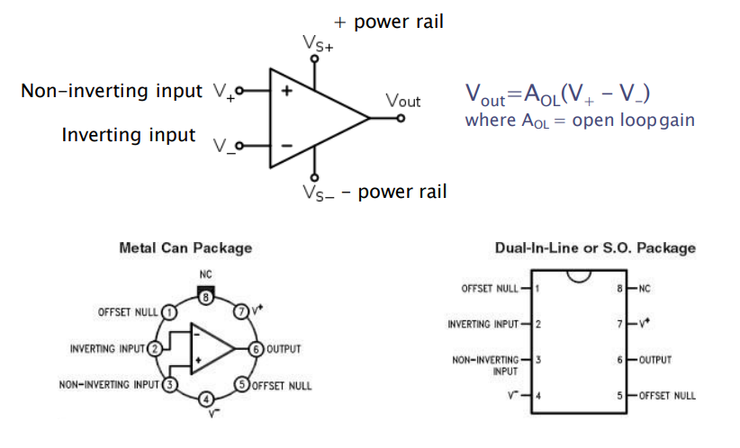
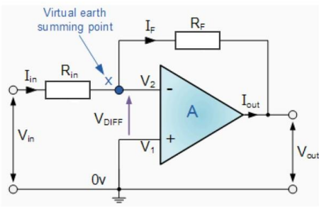
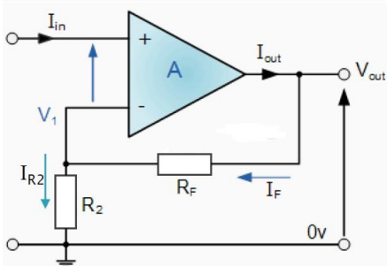
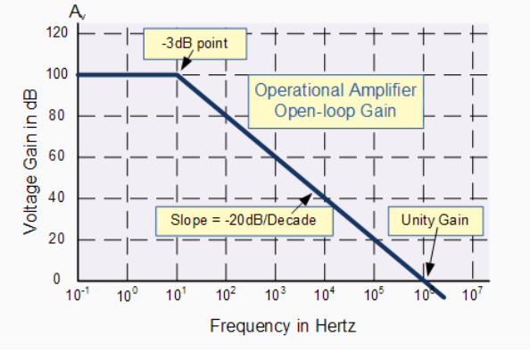
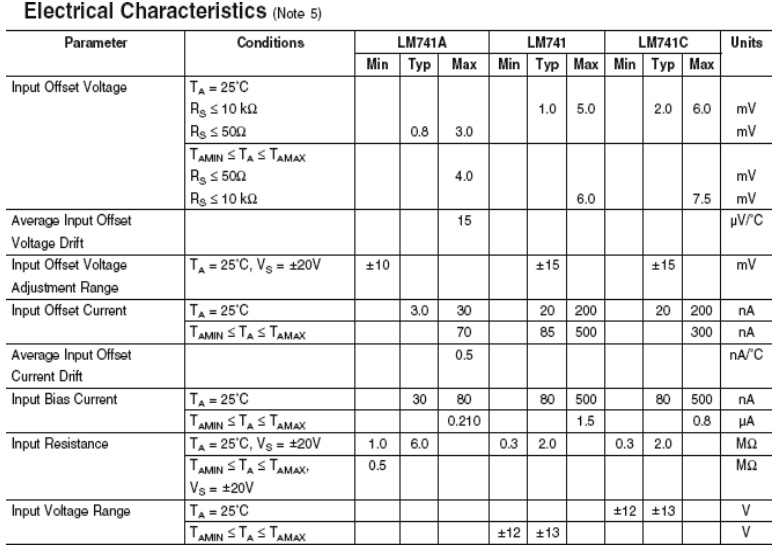
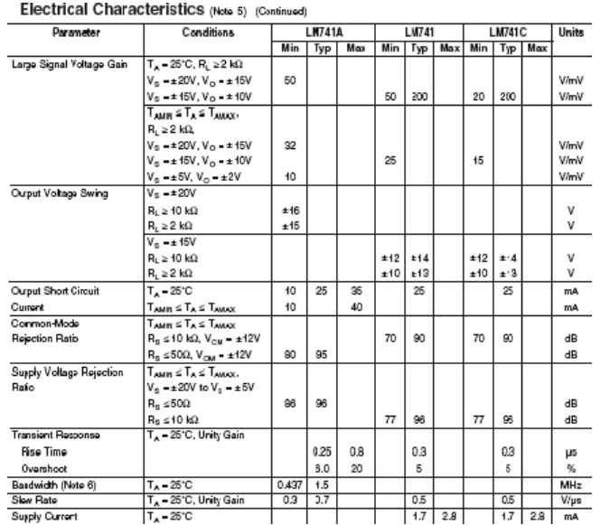
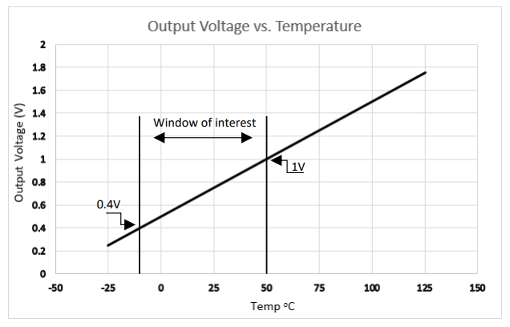
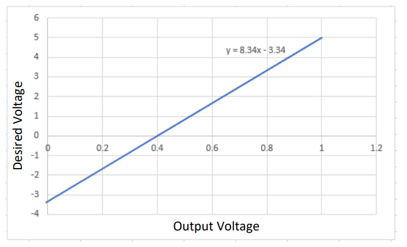
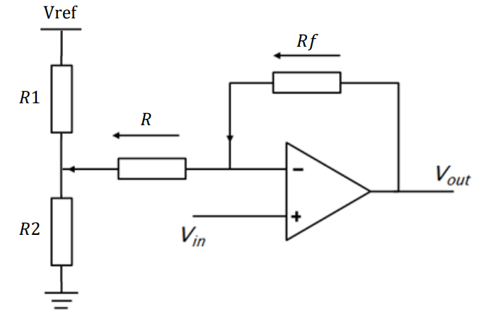

# Operational Amplifiers (OPAmps)

- Electrical signals from sensors and transducers are typically very small in the order of mV or even µV.

- The signals may also be noisy due to electrical interference and offsets created by the sensor/transducer.

- In order to rectify these problems and extract the  required information we use signal processing techniques. The most common of which is signal amplification achieved via Opamps.

- Opamps are perhaps the most versatile of all analogue components and have hundreds of applications such as: Voltage amplification, Current to voltage/voltage to current conversion, Integration, differentiation, voltage addition, subtraction and comparison, filters, PID controllers…….etc etc

- Have a look at [www.Linear.com](www.Linear.com) to see more applications and download the free software LTSpice analogue circuit simulator.

## The Ideal Operational Amplifier
- The ideal opamp has the following characteristics
    - Infinite input impedance, no current is drawn by the device at either input terminal.
    - Infinite gain and bandwidth
    - Zero output impedance
    - The output takes on whatever voltage is required in order to make the voltage at the two input terminals equal

## 741 Operational Amplifier Pin-outs

## Opamp Applications: Inverting Amplifier

This amplifier is made by connecting just two resistors to the amplifier. RF forms the feedback loop from the output to the inverting input implying negative feedback The inverting amplifier inverts the input voltage so a positive input will result in a negative output and vice-versa. A sine wave will be inverted by 180\\(\deg\\).

The analysis of the inverting amplifier is as follows: since the two input terminals must be equal point **X** is at zero volts and is a virtual earth. Secondly since no current is drawn by the device \\(I_{in}\\) must be equal to \\(\frac{V_{in}}{R_{in}}\\). All the current \\(I_F\\) must flow through \\(R_F\\) and this current must be equal to \\(\frac{V_{out}}{R_F}\\) . The two currents \\(I_{in}\\) and \\(I_F\\) must also be equal since again no current flows into the device so \\(I_{in} = I_F\\) and so \\(\frac{V_{in}}{R_{in}} = \frac{V_{out}}{R_F}\\) rearranging for \\(V_{out}\\) we find that:

\\[ V_{out}= -\frac{R_F}{R_{in}}\cdot V_{in}\ \ \ \ \ \ or\ \ \ \ \ \ \frac{V_{out}}{V_{in}}= -\frac{R_F}{R_{in}} \\]

## Opamp Applications: Inverting amp Examples

- The voltage gain of this configuration is determined solely by the ratio of the two resistors \\(R_{F}\\) and \\(R_{in}\\) and is always negative

\\[ V_{out}= -\frac{R_F}{R_{in}}\cdot V_{in}\ \ \ \ \ \ or\ \ \ \ \ \ \frac{V_{out}}{V_{in}}= -\frac{R_F}{R_{in}} \\]

-  The voltage gain of this configuration is determined solely by the ratio of the two resistors RF and Rin and is always negative

    - Example 1:
        -  \\(R_{in}\\) is 1.2k Ohms. The input voltage is to be amplified by 150 what must the value of \\(R_F\\) be? 

            

            
 Answer 

            \\(R_F\\)= 180k Ω

            

    - Example 2:
        - A sensor has a minimum output voltage of 0V and a maximum output voltage of 5 mV. Design an inverting amplifier to scale the voltage from 0 to -10 V

            

            
 Answer 

            Gain of 2000 required so if \\(R_F\\) = 100K Ω and \\(R_{in}\\) = 50Ω

            

##  Opamp Applications: Non-inverting Amplifier

This amplifier configuration gives an output that is not inverted. A positive input results in a positive output and vice-versa. The input voltage is applied to the non-inverting input whist the inverting input is grounded. The benefit of this configuration is that the input impedance is that of the opamp itself (very large) so it will not load any preceding
circuitry. The input impedance of the inverting opamp is the value of \\(R_{IN}\\) which may cause issues with loading.

The analysis of this circuit is as follows: The non-inverting input is at \\(V_{in}\\) so \\(V_1\\) must also be at \\(V_{in}\\). \\(I_{R2}\\) must be equal  to \\(\frac{V_{in}}{R_2}\\) and IF must be equal to \\(\frac{(V_o-V_{in})}{R_F}\\) . \\(I_{R2}\\) must be the same as \\(I_F\\) so \\(\frac{V_{in}}{R_2} = \frac{(V_o-V_{in})}{R_F}\\). Rearranging for \\(V_o\\) we have:

\\[V_{o} = \left(\frac{R_F}{R_2}+1\right)\cdot V_{in}\ \ \ \ \ \ or\ \ \ \ \ \ \frac{V_{o}}{V_{in}} = \frac{R_F}{R_2}+1\\]

##  Opamp Applications: Non-inverting Amplifier Examples

The voltage gain of this configuration is again determined by the two resistors, however we now need to also consider the extra factor of 1.

\\[V_{o} = \left(\frac{R_F}{R_2}+1\right)\cdot V_{in}\ \ \ \ \ \ or\ \ \ \ \ \ \frac{V_{o}}{V_{in}} = \frac{R_F}{R_2}+1\\]

- Example 1: 
    - The input voltage to a non-inverting opamp is 10 mV and must be increased by a factor of 10 for further processing. What would be suitable values for \\(R_F\\) and \\(R_2\\)

    

    
 Answer 

   
    \\(\frac{R_F}{R2} = 9\\) so if \\(R_F = 1k Ω R_2 = 111 Ω\\)

    

- Example 2: 
    - What would happen if \\(R_F\\) were zero (short circuit) and \\(R_2\\) infinitely large (open circuit)?

    

    
 Answer 

    \\(V_o\\) would be equal to \\(V_{in}\\). Is there a use for this circuit?
    
    

## Opamp Applications: Integrator

If the feedback resistor of the inverting opamp is replaced with a capacitor the resulting circuit is known as in integrator. This circuit can be found at the heart of PID controllers and historically was used in analogue computers to solve complex differential equations. In real world applications the integrator suffers from saturation problems since any slight DC offset will cause it to quickly ramp to one of the supply voltages and stay there until reset.

The analysis of the integrator is as follows: The point X is virtual earth so \\(I_{in} = \frac{V_{in}}{R_{in}}\\). If is equal to \\(C\cdot\frac{dV_{out}}{dt}\\). Integrating for \\(V_{out}\\) we have:

\\[V_{out} = - \frac{1}{C}\int_{0}^{t} I_f dt\ \ \ and\ since\ \ \ \ I_f = \frac{V_{in}}{R_{in}},\ \ \ V_{out} = - \frac{1}{R_{in}C}\int_{0}^{t} I_f dt \\\]

## Opamp Applications: Integrator Examples

\\[V_{out} = - \frac{1}{C}\int_{0}^{t} I_f dt\ \ \ and\ since\ \ \ \ I_f = \frac{V_{in}}{R_{in}},\ \ \ V_{out} = - \frac{1}{R_{in}C}\int_{0}^{t} I_f dt \\\]

- Example 1: 
    - An opamp integrator has R = 10k and C = 10µF. \\(V_{in}\\) is equal to 10 mV what will \\(V_{out}\\) be after 10 seconds, 25 seconds , 5 minutes?

    

    
 Answer 

    -1V, -2.5V, -30V (will hit the supply rail first)

    

- Example 2: 
    - What would the output be if we applied a pure sine wave to the integrator?

    

    
 Answer 

    A cosine wave

    

## Opamp Applications: Differentiator

The differentiator amplifier produces a voltage output that is directly proportional to the rate of change of the input voltage with respect to time. If DC is applied to the input then the output will be zero. If an AC type signal is applied to the input then the reactance (\\(X_c\\)) of the capacitor will be dependent upon the frequency. At low frequencies \\(X_c)\\) will be large so the gain will be low. At high frequencies \\(X_c\\) will be small so the gain will be high.

Using your knowledge of Opamps determine the output voltage (Vout) of the differentiator circuit.

   

   
 Answer 

   Point X is at ground so \\(I_{in} = C\cdot\frac{d_{Vin}}{dt}\\). No current is drawn by the Opamp so \\(I_f = \frac{V_{out}}/{R_F}\\). \\(I_{in}\\) is equal to \\(I_F\\) so \\(C\cdot\frac{dV_{in}}{dt} = \frac{V_{out}}{R_F}\\)
. Rearranging for \\(V_{out}\\) we have:

\\[V_{out} = -R_FC\frac{dV_{in}}{dt}\\]

## Non-ideal (Real world Opamps)

- In reality Opamps do not have infinite gain are not environmentally stable and importantly the output of the device will not be zero even if the two inputs are shorted together. There will be some slight differential voltage that will be  amplified by the amp to cause an offset. (Offset null compensation pins are available in order to counteract this effect)

- In an ideal world the opamp would have infinite gain over an infinite input  frequency range. Sadly this is not the case and the gain of the opamp rolls-off alarmingly quickly as the frequency increases.

- The bandwidth (BW) of a particular opamp can be determined by the Gain Bandwidth Product (GBP) of the device and the desired closed loop gain using the equation:

\\[BW = \frac{GBP}{Closed\ loop\ gain}\\]

-  Typically a LM741 Opamp has a GBP of \\(1×10^6\\) if the closed loop gain is set at 1000 then the bandwidth available will be only 1kHz

The open loop gain is very large 100dB \\(20 × Log_{10} Gain = dB\\) so \\(Gain = antilog_{10^\frac{dB}{20}}\\)

- What is the gain at 1 kHz in dB and not dB?

- What gain is available at 1 MHz?

## Data sheet from LM741 Opamp detailing the important input parameters

**Important Input parameters**

- *Input Offset Voltage*: The apparent voltage difference between the inputs even when the inputs are shorted together. For the LM741A the average input offset is 0.8mV with the maximum being 3mV (at 25C). If you had a circuit with a gain of 100 then the output typically could be off by 80mV or as much as 0.3V worst case.

- *Input bias current*: Ideally no current should flow into the opamp. It does. If the bias current is high then the device can load a high impedance source such as a photo diode. Consider using a FET input opamp if connecting to a high input impedance source.

- *Input Resistance*: This is the input impedance looking into either input with the other grounded. Ideally it should be  infinitely large so that the opamp does not load preceding components or sources.

    

- *Large signal voltage gain*: The gain of the opamp at DC (i.e. low frequency). Earlier we stated 
that the gain was infinite. In the real world it's large but not infinite. The minimum gain is listed as 50V/mV (50,000).

- *Common mode rejection ratio*: The ratio of the difference gain to the common mode gain. Opamps are only supposed to amplify the difference between the input pins. In reality, if there is a common voltage (say 1VDC on both pins) there will be a small gain even though the inputs are the same. The CMRR tells you how good the op-amp is at minimizing this common  gain. The LM741A has a worst case CMRR of 80db (20db is a factor of 10 so 80db is a ratio of 10,000). The higher the CMRR the better.

- Slew Rate: How fast the output can change (measured in V/us). This gives you an idea of the maximum frequency and amplitude signal the output can handle without distortion.

    

## OpAmp Scale and Offset

Often sensors do not provide the correct range of output voltages that we need in order to maximise accuracy and resolution. For example, if we wish to use the TMP 36 temperature sensor between the range of -10 and 50oC the output voltage is only around 0.4-1V. If we apply this voltage to a microcontroller with a 10 bit, 5V A-D converter then it is clear we will only be using a limited range of the controller’s capability. What we need to do is rescale and offset the TMP 36’s output voltage, across a specific window of interest, in order to use the whole range of the 10-bit A-D converter.

Fig. 1 TMP 36 Output voltage vs Temperature

Fig. 1 presents the output response of the TMP 36 temperature sensor.

Clearly for our motor predictive maintenance system application we do not need to measure 
temperatures from -25 to 150oC. A more reasonable window of operation would be between -10 and 
50oC. This temperature range coincides with an output voltage range of around 0.4 to 1V. Our aim is 
to scale and offset the range so that microcontroller receives 0 volts when the sensor outputs 0.4 volts
and 5 volts when it outputs 1 volt

Fig. 2 Desired voltage vs TMP 36 output voltage

Fig. 2 presents the output voltage from the TMP 36 against the voltage that we would like to be applied 
to the microcontrollers analogue input. Clearly, we need some gain and offset to achieve this
specification. The straight-line equation can be found by working out the gradient of the plot (5/0.6) 
and then determining the intercept by setting y = 0 and rearranging the equation of a straight line:

\\[ y = mx + c\ \Rightarrow\ \ C = -MX\\]

\\(𝑐 = -𝑚𝑥\\) where \\(𝑚\\) is the gradient (8.334) and at \\(𝑦 = 0, 𝑥 = 0.4\\)
So \\(𝑐 = -(8.34 * 0.4) = -3.34\\).

The straight-line equation is therefore:

\\[ y = 8.34x - 3.34\\]

So we need an overall gain of 8.34 with and offset of 0.4 V (which will also be amplified by 8.34).

The required gain can be achieved by using a non-inverting opamp, the transfer function of which is:

\\[\frac{V_o}{V_{in}}=\frac{R_f}{R}+1\\]

Where \\(𝑅_𝑓\\) is the feedback resistor and \\(𝑅\\) is the input resistor as presented in Fig.3.

Fig. 3 Non-inverting opamp with offset

A potential divider network consisting of R1 and R2 is used in order to apply the required 0.4-volt offset. The required gain is 8.34, implying that the resistor ratio must be 7.34. Any values won’t do. The value of R must be at least 10 times greater than the anticipated value of R2. Assuming a value of R = 10kΩ, Rf must be equal to 73.4kΩ (nearest E12 series combination is 68kΩ and 5.6kΩ). The voltage across R2 must be 0.4 volts (the required offset). With a Vref = 5 volts and selecting R2 = 1kΩ, R1 is found to equal 11.5kΩ (nearest E12 series combination is 6.8kΩ and 4.7kΩ), however R1 may need tweaking in order to achieve ideal scaling. Build and test this circuit using Proteus. You should find that when Vin is 0.4 Volts, Vout is zero Volts (almost) and when Vin is 1 Volt, Vout is 5 Volts.