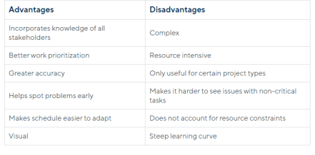

# Critical path Analysis Advantages and Disadvantages

## Advantages
• **Stronger Communication**: Critical path method schedules require input from key players across all stages of a project lifecycle. Bringing together the expertise of various team members and subcontractors, from architects to electricians to construction managers,  makes the schedule more realistic and robust from the start.

• **Easier Prioritization**: Identifying the critical path helps project managers clarify priorities and determine the float of each task. Float, also known as slack, measures how long a task can be delayed before it impacts the completion date. Critical path tasks have zero float, while non-critical activities have positive float. Determining the float of each task helps teams assess priorities. The lower the float, the higher the priority.

• **Improved Accuracy in Scheduling**: The critical path method is a popular and reliable tool for  improving the accuracy of project schedules. 

• **Better Risk Detection**: Critical path schedules make clear the relationships between dependent tasks, so project managers can better predict the knock-on effects of a delay. CPM prevents more surprises and offers earlier opportunities to make corrections than  other methods that do not track dependencies.

• **Greater Adaptability**: When work does not go to plan, CPM network diagrams give project  managers the tools to quickly rework the schedule. 

• **More Visual Impact**: CPM network diagrams and Gantt chart representations of critical path  schedules give project managers a quick understanding of a project’s timeline and progress.  By referring to these visual tools, project managers and team members can develop a more intuitive understanding of a project’s trajectory than they might with a less visually dynamic option.

## Disadvantages

• **Increased Complexity**: The critical path method involves complex calculations with many moving parts. While software can automate the calculations, inputting accurate information  requires detailed research and does not eliminate the risk of human error.

• **Decreased Applicability**: Not all project types lend themselves to the critical path method.  For example, CPM requires that timelines be predictable and repeatable. CPM is not a good  fit for creative projects, such as product design or research tasks, that often come together in unpredictable ways. At the other end of the spectrum, repetitive or independent activities  are not well suited to CPM. For example, a weekly maintenance program may involve 
cleaning dozens of machines, but the order in which the machines are serviced does not  matter.  CPM does not add value because there are no task dependencies, so there is no critical path.

• **Reduced Attention to High-Float Tasks**: When using the critical path method, project  managers focus on critical path tasks. While the critical path does determine total project  duration, using this method can make it easier to ignore non-critical or high-float tasks, thus resulting in delays. For example, installing the electrical system in a new building is not on the critical path because this can occur during a large window of time. However, if project managers forget about wiring work or delay it too long, it will still impact the completion date.

• **Less Insight into Resource Constraint**s: Another drawback of the critical path method is that it does not give good insight into how resource constraints affect project scheduling. The network diagram and CPM schedule do not consider the availability of equipment or labour resources. At the same time, CPM does not highlight overlap of resource use, which can result in congestion. For example, overlaps in the schedule might mean too many workers in a server centre or too much heavy machinery on a construction site. Unnoticed overlaps  might also cause trade stacking, which is when multiple tradespeople, such as electricians and plumbers, try to work in the same location simultaneously, potentially causing delays, safety hazards, and unforeseen costs. These problems compound when a company has multiple projects underway and must coordinate resources among them. CPM on its own is not helpful for spotting these issues. Project managers will need to solicit the expertise of other professionals and resource-based scheduling techniques to gain necessary insight into resource management.

## Summary

