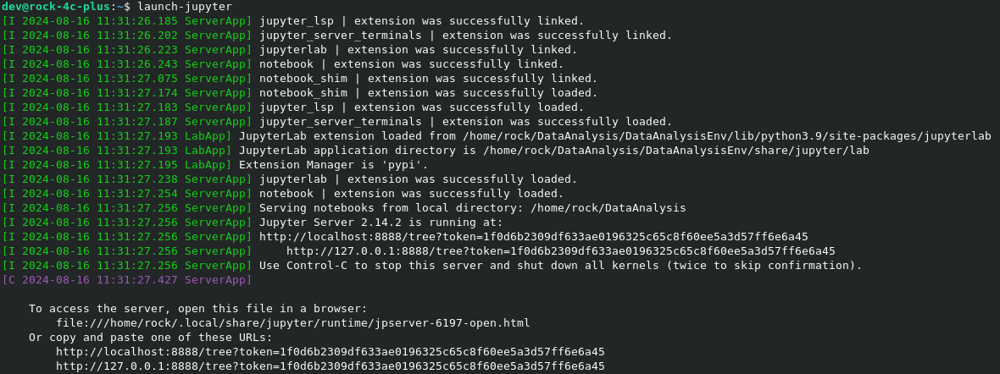
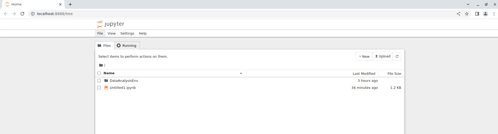
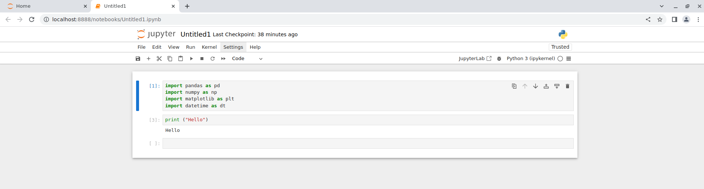
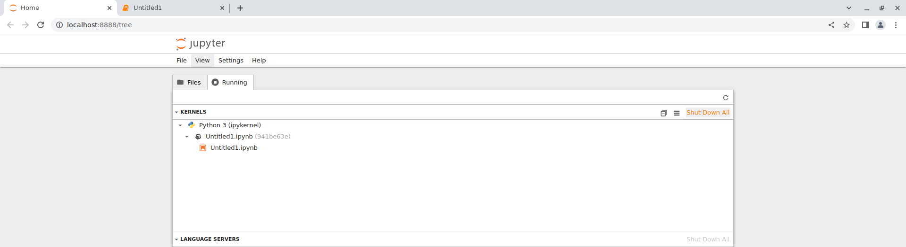
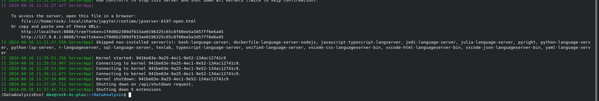

# Data Analysis

## Introduction to Data Analysis/ Visualisation 

### Learning outcomes:

- Identify fundamental concepts related to data analysis/visualisation.
- Apply visualisation tools and techniques to obtain insight from datasets.

#### Topics to be covered:

1.	Introducing some popular libraries for data analysis/visual such as matplotlib, pandas.
2.	Basic skills of processing time series data.
3.	Visualise time series data with line graphs
4.	identify and visualise correlation between data columns with scatter plots and heatmaps.
5.	A hands-on visual task for students to complete.

-------------------

## Introduction to time series forecasting 

### Learning outcomes: 

- Understand basic concepts about time series forecasting. 
- Able to use past data to make predictions about future outcomes. 

#### Topics to be covered:

1.	Basic concepts of time series forecasting

2.	Popular methods of time series data forecasting.

3.	Evaluation of time series forecasting.

4.	A hands-on prediction task for students to complete.

---------------------

## Jupyter Notebook

>**IMPORTANT:**
>> Copy the `DataAnalysis.ipynb` to the the `~/DataAnalysis` directory
>>
>>- `$ cp ~/.MSA/src/Data_Analysis/DataAnalysis.ipynb ~/DataAnalysis`  


1. We will be using Jupyter Notebook to analyses the data from the IoT Predictvice Maintenance system:

- Use the pre-made alias: 
    
    ```sh
    $ launch-jupyter & 
    ```

- or explicity run each command manually: 
    
    ```sh
    $ cd ~/DataAnalysis
    $ source DataAnalysisEnv/bin/activate
    $ jupyter notebook &
    ```

- either way you should see the following output in the terminal:
  
  

2. Should auto launch chrome and you will be greeted with the following page:

    

    >**Note:**
    >> - If not you can go to the browser URL and type the address shown in the terminal
    >> - Locate the line `To access the server, open this in a a browser:`
    >>
    >>   - `file:///home/rock/.local/share/jupyter/runtime/jpserver-6197-open.html`
    >>   - Also, `/jpserver-####-open.html` will be unique to you.

3. A default notebook is present called `Untitled1.ipynb`, double clicking it should launch the folllwing: 

    

4. You can check the running kernel by going back to the orginal host tab and clikcing `Running` to confirm the `Python 3 (ipykernel)` is running like below:

    

5. You can shutdown the jupyter notebook from File and Shutdown, if successful the terminal will display:

    