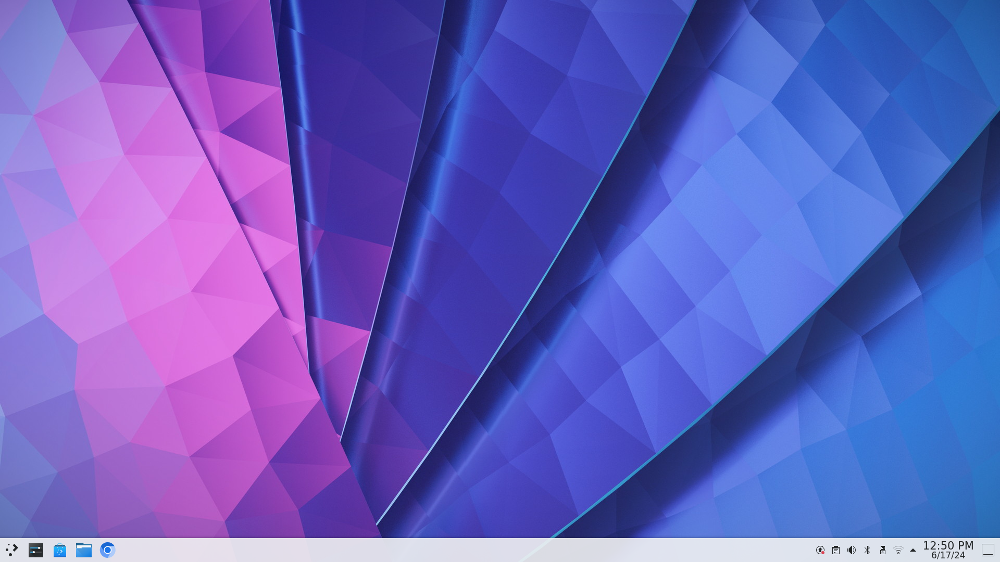
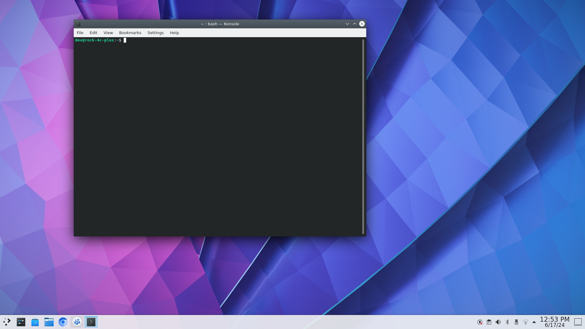

# Getting familiar with the Rock C4+ and Debian OS

This page will give useful information for navigating the Debian OS on the Rock C4+.

> **Note** 
>> When ever you see the following syntax:
>>
>> - `$ command ` or `> output`
>>      - `$` indicates a command to run from the commandline, you don't type the `$`
>>      - `>` indicates an output produce on the commandline

## Getting Started

1. Once Keyboard and mouse are connected and the HDMI cable is plugged into port closet to the audio jack, you can plug in the USB-C power cable. 

2. To login, use the `rock` account and provide the following password `toor`

3. Once logged in you will be greeted with the following view. 

    

4. Now, you need to open a terminal, press the following keys, <kbd>ctrl</kbd>+<kbd>t</kbd>, to open a terminal. 

    

5. You can launch this workbook from the terminal now, or by double clicking the icon on the desktop. 

    -  `$ workbook &`

    > **Note*
    >> - `workbook` is the a command that will launch the web browser with the workbook url, this is local page. 
    >> - `&` *ampersand*, tells the shell to run the preceeding process in the background.

    

<!--
1. `sudo apt update`
    - This should update the system however you may get a response that says:
    ```sh
    > W: An error occured during the signature verifcation. The repository is not updated and the previous index files will be used. GPG error: http://apt.radxa/com/bullseye-stable bullseye InRelease: The following signatures could not be verified because the public key is not available: NO_PUBKEY 9B98116C9AA302C7
    > W: Filed to fetch http://apt.radxa/com/bullseye-stable/dists/bullseye/InRelease The following signatures could not be verified because the public key is not available: NO_PUBKEY 9B98116C9AA302C7
    > W: Some index files failed to download. They have been ignored, or old ones used instead.
    ```
    -  If that is the case you will need to run the following command:
    ```sh
    $ wget -O - apt.radxa.com/focal-stable/public.key | sudo apt-key add
    ```

    - You should get some feedback with a HTTP request and a Warning about apt-key is deprecated... this is fine (if only there was a deterministic, declarative system out there we could have used...)

    - Run the `sudo apt update` again and once finished run `sudo apt upgrade` this my take 10 mins.

    Source: [https://wiki.radxa.com/Rock5/linux/radxa-apt#focal-stable](https://wiki.radxa.com/Rock5/linux/radxa-apt#focal-stable)
-->