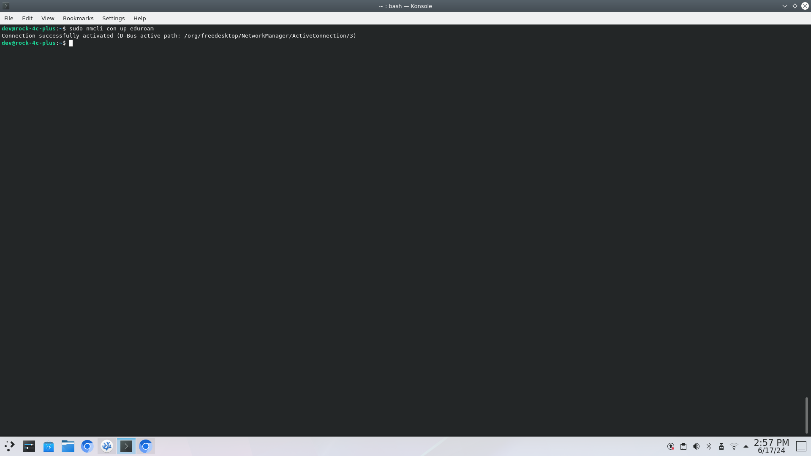

## Networking

The Debain OS for the Rock C4+ uses the `NetworkManager` package to manage all connections to the network interface chips. 

- `NetworkManager` directory is located here -> `/etc/NetworkManager`, the contents of which is:

    ```sh
    NetworkManager.conf
    conf.d/
    dispatcher.d/
    dnsmasq-shared.d/
    dnsmasq.d/
    system-connections/
    ```

- All of your Wi-Fi profiles are stored in the `system-connections` folder, for example:

    ```sh
    $ ls /etc/NetworkManager/system-connections
    > OKdo05.nmconnection
    > eduroam.nmconnection
    ```

    > **Note:**
    >> The file naming convention, `<ssid>.nmconnection`, this is strict and case-sensitive.

- Each `...nmconnection` file has a format and for eduroam, which is an enterprise network it looks like this, you will need to have root level permissions:

    ```sh
    $ sudo cat /etc/NetworkManager/system-connections/eduroam.nmconnection
    ```
    **Output:**
    ```sh
    [connection]
    id=eduroam
    uuid=4e3235f7-8387-4102-8a57-dd1120f29ac5
    type=wifi
    interface-name=wlan0
    permissions=user:dev:;

    [wifi]
    mac-address-blacklist=
    mode=infrastructure
    ssid=eduroam

    [wifi-security]
    auth-alg=open
    key-mmgt=wpa-eap

    [802-1x]
    anonymous-identity=username@gre.ac.uk
    eap=ttls;
    identity=username@greenwich.ac.uk
    password=YOURPASSWORD
    phase2-auth=mschapv2

    [ipv4]
    dns-search=
    method=auto

    [ipv6]
    addr-gen-mode=stable-privacy
    dns-search=
    method=auto

    [proxy]
    ```

1. Change the anonymous-identity, identity and password to that of the Greenwich account you have been assigned. You can use a CLI text editor like `nano`, `vim`, `vi` etc.

    ```sh
    $ sudo nano /etc/NetworkManager/system-connections/eduroam.nmconnection
    ```

    > **Note**
    >> Each text editor is slightly different, for easy mode use `nano`, if you want to "god-mode" then use `vim`
    >> - `nano`:
    >>      - You can type straight away
    >>      - At the bottom of the screen you have shortcut keys:
    >>           - if the pattern has a `^` then this is the <kbd>ctrl</kbd> key
    >>           - likewise `M` is the <kbd>alt</kbd> key
    >>      - When you have navigated and edited the connection credentials, save "Write Out" and "Exit"
    >> - `vim` and `vi`:
    >>      - You need to enter insert mode by typing `i`
    >>      - then you can modify the lines
    >>      - once finished press <kbd>Esc</kbd> key 
    >>      - press <kbd>:</kbd> key to enter command mode and then type the following `wq!` to write, and quite, forceably. 

2. To make sure you connect to the internet you can do the following actions: 
    - `sudo nmcli connection reload`
    - `sudo nmcli con up eduroam`

    

4. You can test the internet connection by typing the following command:

    ```sh
    $ ping -c 4 8.8.8.8
    ```
    - which should return something like this:

    ```
    PING 8.8.8.8 (8.8.8.8) 56(84) bytes of data.
    64 bytes from 8.8.8.8: icmp_seq=1 ttl=59 time=10.5 ms
    64 bytes from 8.8.8.8: icmp_seq=2 ttl=59 time=10.4 ms
    64 bytes from 8.8.8.8: icmp_seq=3 ttl=59 time=10.4 ms
    64 bytes from 8.8.8.8: icmp_seq=4 ttl=59 time=10.4 ms

    --- 8.8.8.8 ping statistics ---
    4 packets transmitted, 4 received, 0% packet loss, time 3005ms
    rtt min/avg/max/mdev = 10.350/10.407/10.516/0.064 ms
    ```

    - if so, congrats you are connected, if not we can troubleshoot, just ask.