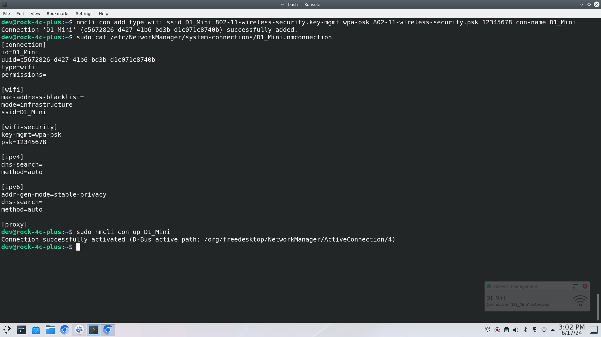

## Connecting to the IoT Network

Similarly to the [Internet setup](../Internet/Internet.md), we need to connect to the ESP8266 network.

1. We can do this two different ways, the first is to use the `nmcli` command to setup the network, or we can navigate to the `/etc/NetworkManger/system-connections/` and create the network connection file ourselves. 

2. Both ways will be run through, select the method you want to follow... 


    <details>
    <summary>Create the config file manually</summary>

    * Elevate your self to root and create the file that will serve as configuration file to connect to YOUR ESP8266 access point (AP). Remember to get the name of your AP from your ESP8266 .ino file.

        ```sh
        sudo nano /etc/NetworkManager/system-connections/YOURESP8266APSSID.nmconnection
        ```

        > **Note**
        >> For example my ESP8266 AP is predicitveEP8266, so I woul replace `YOURESP8266APSSID.nmconnection` with `predicitveEP8266.nmconnection`


    * Reproduce the following configuration, it is important you have no spelling or syntax errors. 

        ```
    [connection]
    id=NAME_FOR_YOUR_CONNECTION
    type=wifi
    permissions=

    [wifi]
    mac-address-blacklist=
    mode=infrastructure
    ssid=YOUR_ESP8266_AP_SSID

    [wifi-security]
    key-mgmt=wpa-psk
    psk=YOUR_ESPE8226_SSID_PASSWORD

    [ipv4]
    dns-search=
    method=auto

    [ipv6]
    addr-gen-mode=stable-privacy
    dns-search=
    method=auto
        ```

    </details>

    <details>
    <summary>Use `nmcli` command</summary>
    
     * To create the connection entry you can use the `nmcli` command by supplying options and arguments:

        ```
        $ nmcli con add type wifi ssid YOUR_ESP8266_AP_SSID 802-11-wireless-security.key-mgmt wpa-psk 802-11-wireless-security.psk YOUR_ESPE8226_SSID_PASSWORD con-name NAME_FOR_YOUR_CONNECTION
        ```
    </details>


3. Once you have created the connection, you need to connect:

    - if you are already connected to eduroam, do the following first:

        ```sh
        $ nmcli con down eduroam
        ```

    - eitherway you then need to:

        ```sh
        $ ncmli con up your_esp8266_ap_ssid
        ```

    - if prompted for a password for the new connection, provide it.

4. You should now be connected, to test you can run the following command
    ```sh
    $ ifconfig
    ```

    

5. If you have a connection, open a new tab and type `192.168.4.1` to access the webapage hosted by the ESP8266: 


6. As you can see you can see the data and a few buttons you can press that tell the motor to stop, forward or reverse. 


7. This is fine, but we need to store the data, as this webpage does not provide presisent storage, navigate to the [Python Script](./Python_Script.md) page.