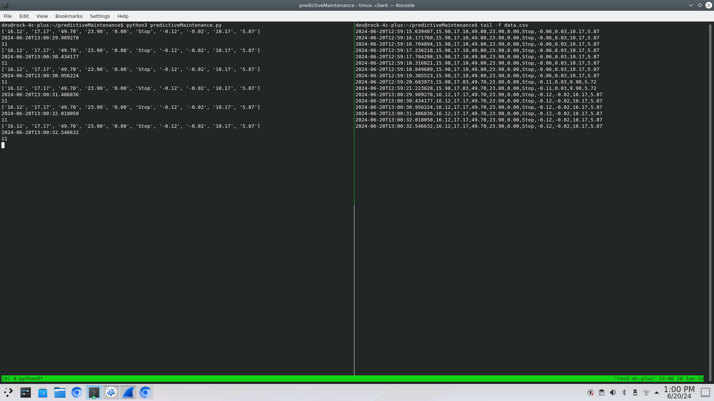

# Building a Predictive Maintenance Script in Python

This section will help you build a Python script for predictive maintenance, step by step. The script will request data over HTTP and write the data to a specified location.

## Step 1: Create the Directory

First, let's create a directory to store your script and related files.

Open your terminal and run the following command:

```sh
$ mkdir ~/predictiveMaintenance
```

> **Explanation:** 
>> - `mkdir` is used to create a new directory.
>> - `~` represents your home directory, 
>> - `predictiveMaintenance` is the name of the directory.


## Step 2: Navigate to the Directory

Change to the newly created directory:

```sh
$ cd ~/predictiveMaintenance
```

> **Explanation:** 
>> - `cd` stands for "change directory". This command moves you into the `predictiveMaintenance` directory.

## Step 3: Create the Python Script File

Create a new Python file called `predictiveMaintenance.py` using a text editor. You can use either `nano` or `vim`.

Using `nano`:

```sh
$ nano predictiveMaintenance.py
```

Using `vim`:

```sh
vim predictiveMaintenance.py
```

> **Explanation:**
>> - These commands open a text editor (`nano` or `vim`) and create a new file called `predictiveMaintenance.py`.


## Step 4: Add Header Information

Start by adding the header information to your script:

```py
# FILE: predictiveMaintenance.py
# AUTHORS: Name of everyone who is in your team
# Version: 1.0.0
# NOTES: Script requests data over HTTP and writes it to a specified location.
```

> **Explanation:** 
>> - These comments provide metadata about the script, including the filename, author, version, and a brief description of what the script does.

## Step 5: Import Required Packages

Next, import the necessary Python packages:

```py
... 
import requests
import csv
import os
import sys
from datetime import datetime
import time
```

> **Explanation:**
>> - `...` indicates to you, that there is more code above but it is not shown for brevity, do not write `...`
>> - `requests` : Allows you to send HTTP requests.
>> - `csv` : Provides functionality to read from and write to CSV files.
>> - `os` : Provides a way of interacting with the operating system.
>> - `sys` : Provides access to system-specific parameters and functions.
>> - `datetime` : Supplies classes for manipulating dates and times.
>> - `time` : Provides various time-related functions.

## Step 6: Define Constants

Define constants for the data log path and delay between requests:

```py
...
# The path to the data log
data_log_csv = '/home/rock/predictiveMaintenance/data.csv'

# Delay (in seconds)
delay = 0.5
```

> **Explanation:**
>> - `data_log_csv`: Specifies the path to the CSV file where data will be logged.
>> - `delay`: Sets a delay of 0.5 seconds between each data request.

## Step 7: Create the Main Loop

Write the main loop that will run indefinitely. Add the following code to your script:

### Step 7.1: Start the Main Loop

```py
...
# Run forever, or until the program is killed
while True:

```

> **Explanation:** 
>> - This creates an infinite loop that will run continuously until the program is manually stopped.


### Step 7.2: Try Block


```py
...
while True:
    try:

```

> **Explanation:**
>> - This starts a `try` block to handle any exceptions that might occur during the execution of the code inside the loop.


### Step 7.3: Perform a GET Request and Decode the Response

```py
...
while True:
    try:
        # Perform a GET request from the ESP8266
        r = requests.get('http://192.168.4.1/sbc')

        # Decode the response and split by the delimiter ','
        data = r.content.decode("ascii").split(',')
```

> **Explanation:** 
>> - The first new line sends an HTTP GET request to the specified URL (`http://192.168.4.1/sbc`) to retrieve data from the ESP8266 device.
>> - The second new line decodes the response content from ASCII format and splits it into a list using a comma as the delimiter.


### Step 7.4: Print the Data

For debugging purposes we can return the the decoded response to the terminal:

```py
...
while True:
    try:
        # Perform a GET request from the ESP8266
        r = requests.get('http://192.168.4.1/sbc')

        # Decode the response and split by the delimiter ','
        data = r.content.decode("ascii").split(',')

        print(data)
```

### Step 7.5: Add a Timestamp

```py
        ...
        print(data)

        # Prepend the timestamp with microsecond precision
        timestamp = datetime.now().isoformat(timespec='microseconds')
        data.insert(0, timestamp)

```

> **Explanation:**
>> - `datetime.now().isoformat(timespec='microseconds')`: Gets the current timestamp with microsecond precision and formats it as a string.
>> - `data.insert(0, timestamp)`: Inserts the timestamp at the beginning of the data list.

### Step 7.6: Check Data Length

```py 
        ...
        data.insert(0, timestamp)

        # Check message is the correct length (timestamp + data)
        if len(data) == 11:
```

> **Explanation:**
>> - This checks if the length of the data list is 11 (timestamp plus 10 data points). We don't want to write missing data points.


### Step 7.7: Check if File Exists


```py
        ...
        if len(data) == 11:
           
            # Check if the file exists, if not, create it or fail and close the program
            if not os.path.exists(data_log_csv):
```

> **Explanation:**
>> -  This checks if the CSV file specified by data_log_csv exists. If it does not exist, the following code block will create it.

### Step 7.8: Create and Write Headers to CSV


```py
        ...
            # Check if the file exists, if not, create it or fail and close the program
            if not os.path.exists(data_log_csv):

                with open(data_log_csv, mode='w', newline='') as file:
                    writer = csv.writer(file)
                    
                    # Set first row headers
                    writer.writerow(['TimeStamp','TMP36_Temp',
                     'DHT11_Ambient_Temp','DHT11_Humidity',
                     'Motor_Temperature','Motor_Speed_(RPM)',
                     'Motor_State','Accel_x-axis','Accel_y-axis',
                     'Accel_z-axis', 'RMS_Vibration'])

```

> **Explanation:**
>> - `with open(data_log_csv, mode='w', newline='') as file:`: Opens the CSV file in write mode. If the file doesn't exist, it will be created.
>> - `csv.writer(file)`: Creates a CSV writer object.
>> - `writer.writerow([...])`: Writes the header row to the CSV file.

### Step 7.9: Append Data to CSV

```py
      ...
            # Check if the file exists, if not, create it or fail and close the program
            if not os.path.exists(data_log_csv):
                ...
            # Append CSV with the data
            with open(data_log_csv, mode='a', newline='') as file:
                writer = csv.writer(file)
                writer.writerow(data)
```

> **Explanation:**
>> - `with open(data_log_csv, mode='a', newline='') as file:`: Opens the CSV file in append mode to add new data without overwriting the existing content.
>> - `csv.writer(file)`: Creates a CSV writer object.
>> - `writer.writerow(data)`: Writes the data row to the CSV file.

### Step 7.10: Add Delay

```py
      ...
            # Append CSV with the data
            with open(data_log_csv, mode='a', newline='') as file:
                writer = csv.writer(file)
                writer.writerow(data)

        # Add delay
        time.sleep(delay)
```

> **Explanation:**
>> - This pauses the script for the duration specified by delay (0.5 seconds).

### Step 7.11: Exception Handling


```py
# Run forever, or until the program is killed
while True:
    try:
        ...
    # Any exceptions are caught and returned to the CLI
    except Exception as e:
        print(f"Error: {e}")
        print("Unable to create or write to the CSV file. Program will now exit")
        sys.exit(1)

```

> **Explanation:**
>>
>> - `except Exception as e:`: Catches any exceptions that occur during the execution of the `try` block.
>> - `print(f"Error: {e}")`: Prints the error message to the terminal.
>> - `print("Unable to create or write to the CSV file. Program will now exit")`: Prints an error message indicating that the program will exit.
>> - `sys.exit(1)`: Exits the program with an error code of 1.


## Step 8: Making the script an executable

Before running the script, ensure you have the necessary permissions. Make the script executable:

```sh
$ chmod +x predictiveMaintenance.py
```

> **Explanation:**
>> - The `chmod` command in Unix/Linux systems is used to change the file mode bits of a file. These bits determine the file's permissions. >> - The `+x` argument specifically adds execute permissions to the file for the user, group, and others
>> - For example, before `chmod +x`, the file permissions might look like this:
>>      ```sh
>>      -rw-r--r-- 1 user group  4096 Jun 14 12:34 predictiveMaintenance.py
>>      ```
>>      After running chmod +x, the permissions change to:
>>
>>      ```sh
>>      -rwxr-xr-x 1 user group  4096 Jun 14 12:34 predictiveMaintenance.py
>>      ```

## Step 9: Running the script:

You should be able to run the script like this: 

```sh
$ ./predictiveMaintenance.py
```

or 

```sh
$ python3 predictiveMaintenance.py
```

The output should look like: 

```
>
```

If you open another terminal, <kbd>ctrl</kbd>+<kbd>t</kbd>, you can look in the content of the `data.csv` file: 

```sh
$ tail -f predictiveMaintenance/data.csv
```

or 

```sh
$ less +G predictiveMaintenance/data.csv
```
You can download some example data captured before: [data.csv](../../predictiveMaintenance/data.csv)

The output these commands should look something like this, and everytime there is a change you get an additionally line with the latest data. 



## Step 10: Gathering the Data

We need to let the data run for some time to build a large enough data set for any predictive modelling. We can estimate the number lines generated over a given period, as we know that there is a delay of ~500ms. So roughly 2 every second, calculate how many data points you can have for:

- 1 min
- 15 mins
- 30 mins
- 60 mins
- 120 mins
- 240 mins

from each of these we can calculate the file size in BiBytes for the CSV for each 

<details>
<summary>Full Code Here</summary>

```py
# FILE: predicitiveMaintenance.py
# AUTHOR: Seb Blair (CompEng0001)
# Version: 1.0.0
# NOTES: script requests the data over HTTP and then writes the data to a specified location. 

import requests
import csv
import os
import sys
from datetime import datetime
import time

# Run forever, or until the program is killed
while True:
    try:
        # Perform a GET request from the ESP8266
        r = requests.get('http://192.168.4.1/sbc')

        # Decode the response and split by the delimiter ','
        data = r.content.decode("ascii").split(',')

        print(data)

        # Prepend the timestamp with microsecond precision
        timestamp = datetime.now().isoformat(timespec='microseconds')
        data.insert(0, timestamp)

        # Check message is the correct length (timestamp + data)
        if len(data) == 11:
            # Check if the file exists, if not, create it or fail and close the program
            if not os.path.exists(data_log_csv):
                with open(data_log_csv, mode='w', newline='') as file:
                    writer = csv.writer(file)
                    
                    # Set first row headers
                    writer.writerow(['TimeStamp','TMP36_Temp', 'DHT11_Ambient_Temp','DHT11_Humidity','Motor_Temperature','Motor_Speed_(RPM)','Motor_State','Accel_x-axis','Accel_y-axis','Accel_z-axis', 'RMS_Vibration'])

            # Append CSV with the data
            with open(data_log_csv, mode='a', newline='') as file:
                writer = csv.writer(file)
                writer.writerow(data)

        # Add delay
        time.sleep(delay)

    # Any exceptions are caught and returned to the CLI
    except Exception as e:
        print(f"Error: {e}")
        print("Unable to create or write to the CSV file. Program will now exit")
        sys.exit(1)

```

</details>