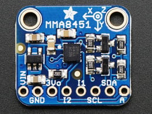
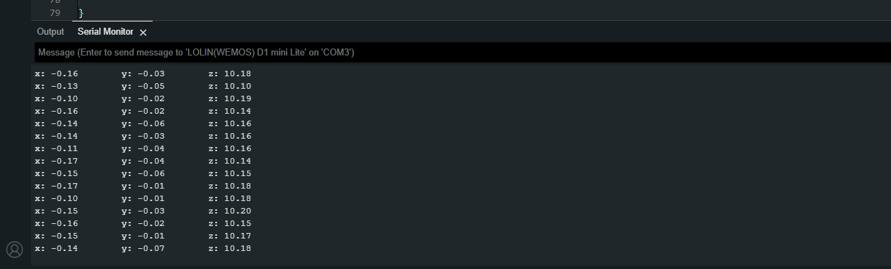

# Testing the Accelerometer

In order to understand the this component it is important to review the supporting technical documentation: 

- [MMA8451Q Accelerometer Datasheet](../../Data_Sheets/MMA8451Q.pdf)

<div align=center>



</div>

We can see from table 12 on page 20 that the x,y and z values are stored in to MSB and LSB values in the respectiuve registers 0x1,0x2,..., 0x6

Normally we would have to write the code to obtain the information from the chip ourselves luckily, libaries are written for us: 

- [Wire.h](https://github.com/esp8266/Arduino/blob/master/libraries/Wire/Wire.h)

- [Adafruit_MMA8451.h](https://github.com/adafruit/Adafruit_MMA8451_Library/blob/master/Adafruit_MMA8451.h)

- [Adafruit_Sensor.h](https://github.com/adafruit/Adafruit_Sensor/blob/master/Adafruit_Sensor.h)

Luckily you can click these links below to download the zips that needed to be addedd to the Arduino Libraries: 

- [Wire]()
- [Adafruit_MMA8451](https://github.com/adafruit/Adafruit_MMA8451_Library/archive/refs/heads/master.zip)
- [Adafruit_Sensor](https://github.com/adafruit/Adafruit_Sensor/archive/refs/heads/master.zip)

Once downloaded, you can use the import function within the Arduino software to unzip the folders into `/path/to/Arduino/Libraries/`, `Sketch` -> `Include Library` -> `Add .Zip Library...`, then navigate to the `/path/to/zipped_library` to include it.

## Developing the script

1. Create a new a script call it something meaningful like, `accelerometer_test.ino`

2. Start by adding the standard header information about the script

    ```cpp
    /*
    * AUTHORS: YOUR NAMES
    * VERSION: 1.0.O
    * NOTES: 
    *      - for testing the MMA8451Q accelerometer sensor
    *      - Make sure common ground between sensor and microcontroller.
    *      - Pin = 4 SDA Pin 5 = SCL on Lolin.
    */
    ```

3.  Using the `#include` directive reference the wire, Adafruit_MMA845, Adafruit_Sensor libraries:

    ```cpp
    ...

    #include <Wire.h>
    #include <Adafruit_MMA8451.h>
    #include <Adafruit_Sensor.h>
    ```

    > **Note:** 
    >> - If you see `...` that means that other code is hidden for brevity

4. Because `cpp` is a obkect orientated programming lanaguage we have the ability to use repeatable templates (*classes*) for code as *objects*. Next we create object of the `Adafruit_MMA8451` class

    ```cpp
    ...

    Adafruit_MMA8451 mma = Adafruit_MMA8451();
    ```

5. Next we need to add the following code to inside the `void setup(void)`:
   - Set up serial communication
   - Set pin modes
   - Set up our `mma` objects communication to the MMA8451Q chip over IIC

    ```cpp
    ...

    void setup(void){
    Serial.begin(115200); // setting Baudrate 
    pinMode(D0, OUTPUT); // PWM (motor pin)
    pinMode(D5, OUTPUT); // Direction (SCL pin)

    // Motor in stop state
    digitalWrite(D5, LOW);
    analogWrite(D0, 0);

    // connect to the MMA8451Q sensor, over Pin 4
    if (!mma.begin()){
        Serial.println("Couldnt start");
        while (1)
        ;
    }
    // Set range to required G
    mma.setRange(MMA8451_RANGE_2_G); // divides each recieved x,y and z by 4096
    // mma.setRange(MMA8451_RANGE_4_G); // divides each recieved x,y and z by 2048
    // mma.setRange(MMA8451_RANGE_8_G); // divides each recieved x,y and z by 1024
    }
    ...
    ```

6. Now we need to build the functionality to turn on/off and change the direction of the motor and return the vibration sensor data to the terminal, reproduce the following code for the `void loop(void)`:

    ```cpp
    void loop(){
        sensors_event_t event;
        mma.getEvent(&event);

        digitalWrite(D5, LOW); // Motor Forward @500
        analogWrite(D0, 500);
        for (int i = 0; i < 200; i++){
            sensors_event_t event;
            printEvent();
            delay(10);
        }

        digitalWrite(D5, LOW); // Motor Stop
        digitalWrite(D0, LOW);
        for (int i = 0; i < 100; i++){
            sensors_event_t event;
            printEvent();
            delay(10);
        }

        digitalWrite(D5, LOW); // Motor Forward @1000
        analogWrite(D0, 1000);
        for (   int i = 0; i < 200; i++){
            sensors_event_t event;
            printEvent();
            delay(10);
        }

        digitalWrite(D5, LOW); // Motor Stop
        digitalWrite(D0, LOW);
        for (int i = 0; i < 100; i++){
            sensors_event_t event;
            printEvent(event);
            delay(10);
        }
    }
    ```

    > **Note:**
    >> It appears there is some repeat code here, that is fine we just want to show that there are clear steps. You could refactor this to remove duplicates like this
    >> <details>
    >> <summary>refactored code</summary>
    >>
    >>  ```cpp
    >>    sensors_event_t event;
    >>    mma.getEvent(&event);
    >>
    >>    digitalWrite(D5, LOW); // Motor Forward @500
    >>    analogWrite(D0, 500);
    >>    getData(200);   
    >>    
    >>    digitalWrite(D5, LOW); // Motor Stop
    >>    digitalWrite(D0, LOW);
    >>    getData(100);
    >>
    >>    digitalWrite(D5, LOW); // Motor Forward @1000
    >>    analogWrite(D0, 1000);
    >>   getData(200);
    >>
    >>    digitalWrite(D5, LOW); // Motor Stop
    >>    digitalWrite(D0, LOW);
    >>    getData(100);
    >>
    >>    void getData(int bound){
    >>        for (int i = 0; i < bound; i++){
    >>            sensors_event_t event;
    >>            printEvent(event);
    >>            delay(10);
    >>        }
    >>    }
    >>  ```


7. You'll notice that there is a function called `printEvent()`, we need to add this to the buttom of the script:

    ```cpp
    void printEvent(sensors_event_t event){
        mma.getEvent(&event);
        Serial.print("x: ");
        Serial.print(event.acceleration.x);
        Serial.print("\ty: ");
        Serial.print(event.acceleration.y);
        Serial.print("\tz: ");
        Serial.print(event.acceleration.z);
        Serial.println();
    }
    ```

    > **Note:**
    >> - If we want to plot this data later, we can comment out the `Serial.print("...");`

8. Running the code you should see the following, if you can even wobble the board to...

    

## Full code below

<details>
<summary>Click here:</summary>

```cpp
/*
* AUTHORS: YOUR NAMES
* VERSION: 1.0.O
* NOTES: 
*      - for testing the MMA8451Q accelerometer sensor
*      - Make sure common ground between sensor and microcontroller.
*      - Pin = 4 SDA Pin 5 = SCL on Lolin.
*/

#include <Wire.h>
#include <Adafruit_MMA8451.h>
#include <Adafruit_Sensor.h>

Adafruit_MMA8451 mma = Adafruit_MMA8451();

void setup(void)
{
  Serial.begin(115200);
  pinMode(D0, OUTPUT); // PWM
  pinMode(D5, OUTPUT); // Direction

  // Motor in stop state
  digitalWrite(D5, LOW);
  analogWrite(D0, 0);

  if (!mma.begin())
  {
    Serial.println("Couldnt start");
    while (1)
      ;
  }
  // Set range to required G
  mma.setRange(MMA8451_RANGE_2_G); // divides each recieved x,y and z by 4096
  // mma.setRange(MMA8451_RANGE_4_G); // divides each recieved x,y and z by 2048
  // mma.setRange(MMA8451_RANGE_8_G); // divides each recieved x,y and z by 1024
}

void loop()
{
  sensors_event_t event;
  mma.getEvent(&event);

    digitalWrite(D5, LOW); // Motor Forward @500
    analogWrite(D0, 500);
    getData(200);   

    digitalWrite(D5, LOW); // Motor Stop
    digitalWrite(D0, LOW);
    getData(100);

    digitalWrite(D5, LOW); // Motor Forward @1000
    analogWrite(D0, 1000);
    getData(200);

    digitalWrite(D5, LOW); // Motor Stop
    digitalWrite(D0, LOW);
    getData(100);
}

void getData(int bound){
    for (int i = 0; i < bound; i++){
        sensors_event_t event;
        printEvent(event);
        delay(10);
    }
}

void printEvent(sensors_event_t event){
    mma.getEvent(&event);
    Serial.print("x: ");
    Serial.print(event.acceleration.x);
    Serial.print("\ty: ");
    Serial.print(event.acceleration.y);
    Serial.print("\tz: ");
    Serial.print(event.acceleration.z);
    Serial.println();

}
```

</details>