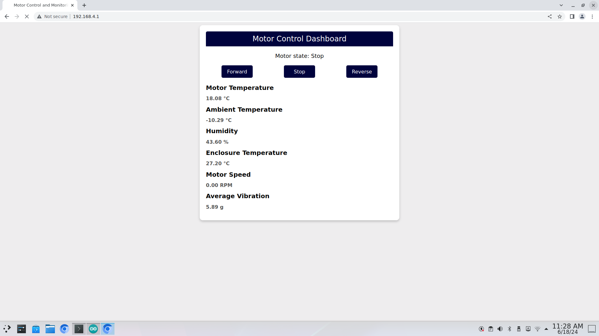

# Building an HTML Page for Motor Control and Monitoring Web Server

This guide will help you build an HTML page for a motor control and monitoring web server. This page is hosted by the Arduino web server and will be served when someone connects to the correct IP address.

Should look like this once complete:



## Step 1: Define the HTML Page

1. Open a new file in your Arduino script folder called `index.h`

2. Start by defining the HTML page as a constant string in your Arduino script. This is done using the `const char` keyword and stored in the program memory using `PROGMEM`.

    ```cpp
    const char MAIN_page[]PROGMEM=R"=====(
    ```

    > **Explanation:**
    >> - `const char MAIN_page[]PROGMEM`: Defines a constant character array named MAIN_page and stores it in the program memory (`PROGMEM`). This helps in saving SRAM space.
    >> - `R"=====(`: The R prefix denotes a raw string literal, allowing you to include special characters without needing escape sequences

## Step 2: Start the HTML Document

3. Begin the HTML document with the `<!DOCTYPE html>` declaration and the opening `<html>` tag.

    ```html
    ...
    <!DOCTYPE html>
    <html>
    ```

    > **Explanation:**
    >> - `<!DOCTYPE html>`: Declares the document type and version of HTML. It helps the browser to render the page correctly.
    >>- `<html>`: The root element of the HTML document.

## Step 3: Add the Head Section

4. Include metadata, a title, and CSS styles within the `<head>` section.

    ```html
    ...
        <head>
            <meta http-equiv="refresh" content="5">
            <title> Motor Control and Monitoring Web Server </title>
            <style>
                body {
                    font-family: Arial, sans-serif;
                    background-color: #EEEDEE;
                }

                .container {
                    max-width: 600px;
                    margin: 0 auto;
                    padding: 20px;
                    background-color: #FFFFFF;
                    border-radius: 10px;
                    box-shadow: 0 4px 8px rgba(0, 0, 0, 0.2);
                }

                .header {
                    background-color: #00033D;
                    color: white;
                    text-align: center;
                    padding: 10px;
                    font-size: 24px;
                    border-radius: 5px 5px 0 0;
                }

                .status {
                    font-size: 18px;
                    text-align: center;
                    margin-top: 20px;
                }

                .sensor {
                    margin-top: 20px;
                }

                .sensor h1 {
                    font-size: 20px;
                    margin-bottom: 10px;
                }

                .sensor h2 {
                    font-size: 16px;
                    color: #555;
                }
                .buttons {
                    display: flex;
                    justify-content: space-around;
                    margin-top: 20px;
                }

                .button {
                    width: 100px;
                    height: 40px;
                    font-size: 16px;
                    background-color: #00033D;
                    color: white;
                    border: none;
                    border-radius: 5px;
                    cursor: pointer;
                }
            </style>
        </head>
    ```

    > **Explanation:**
    >> - `<meta http-equiv="refresh" content="5">`: Refreshes the page every 5 seconds.
    >> - `<title>`: Sets the title of the page, which appears in the browser tab.
    >> - `<style>`: Defines CSS styles for the HTML elements.
    >> - `div.card`: Styles for a card element, including width, shadow, text alignment, border radius, and background color.
    >> - `div.header`: Styles for the header element, including background color, text color, padding, font size, and border radius.
    >> - `div.container`: Styles for the container element, including padding.
    >> - `.button` \ `.buttons`: Styles for buttons
    >> - `.sensor`\ `.sensor h1` \ `.sensor h2`: stytles for sensor inforation

## Step 4: Add the Body Section

Create the body section with forms and data placeholders.

### Step 4.1: Add Form for Motor Control

```html
    ...
    <body>
        <div class="container">
            <div class="header">Motor Control Dashboard</div>
            <div class="status">Motor state: <span id="motorState">@@status@@</span></div>
                <form method ="get" action= "/form" class="buttons">
                <input type=submit name="button" value="Forward" class=button>
                <input type=submit name="button" value="Stop" class=button>
                <input type=submit name="button" value="Reverse" class=button>
                </form>
```

### Step 4.2: Add Sensor Data Display

```html
...
            <div class="sensor">
                <h1>Motor Temperature</h1>
                <h2><span id="motorTemp">@@m_temp@@  &deg;C</span></h2>

                <h1>Ambient Temperature</h1>
                <h2><span id="ambientTemp">@@a_temp@@  &deg;C</span></h2>

                <h1>Humidity</h1>
                <h2><span id="humidity">@@humidity@@ &percnt;</span></h2>

                <h1>Enclosure Temperature</h1>
                <h2><span id="enclosureTemp">@@motor_temp@@  &deg;C</span></h2>

                <h1>Motor Speed</h1>
                <h2><span id="motorSpeed">@@motor_speed@@ RPM</span></h2>

                <h1>Average Vibration</h1>
                <h2><span id="vibration">@@vibration@@ g</span></h2>
            </div>
        </div>
    </body>
```

## Step 5: End the HTML Document

Close the HTML document with the closing `</html>` tag and the closing delimiter for the raw string literal.

```html
...
</html>
)=====";
```

> **Explanation:**
>> - `</html>`: Closes the root HTML element.
>> - `)====="`: Closes the raw string literal started by `R"=====(`.

## Step 6: import into your Arduino script

At the top of your Predictive.ino, where you have your include directives add the following `"include index.h"`

```cpp
#include <ESP8266WiFi.h>
#include <WiFiClient.h>
#include <ESP8266WebServer.h>
#include <DHTesp.h>
#include <Wire.h>
#include <Adafruit_MMA8451.h>
#include <Adafruit_Sensor.h>
#include "index.h" // < - wedpage here
```

Now you completed that, continue with the next section here -> [Uploading and Running ](./Upload_Running.md)


<details>
<summary>Full Code here... </summary>


```html
const char MAIN_page[]PROGMEM=R"=====(
<!DOCTYPE html>
<html>
<head>
    <meta http-equiv="refresh" content="5">
    <title>Motor Control and Monitoring</title>
    <style>
        body {
            font-family: Arial, sans-serif;
            background-color: #EEEDEE;
        }

        .container {
            max-width: 600px;
            margin: 0 auto;
            padding: 20px;
            background-color: #FFFFFF;
            border-radius: 10px;
            box-shadow: 0 4px 8px rgba(0, 0, 0, 0.2);
        }

        .header {
            background-color: #00033D;
            color: white;
            text-align: center;
            padding: 10px;
            font-size: 24px;
            border-radius: 5px 5px 0 0;
        }

        .status {
            font-size: 18px;
            text-align: center;
            margin-top: 20px;
        }

        .sensor {
            margin-top: 20px;
        }

        .sensor h1 {
            font-size: 20px;
            margin-bottom: 10px;
        }

        .sensor h2 {
            font-size: 16px;
            color: #555;
        }
        .buttons {
            display: flex;
            justify-content: space-around;
            margin-top: 20px;
        }

        .button {
            width: 100px;
            height: 40px;
            font-size: 16px;
            background-color: #00033D;
            color: white;
            border: none;
            border-radius: 5px;
            cursor: pointer;
        }
    </style>
</head>
<body>
<div class="container">
    <div class="header">Motor Control Dashboard</div>
    <div class="status">Motor state: <span id="motorState">@@status@@</span></div>
        <div class="buttons">
        <button class="button" onclick="sendCommand('Forward')">Forward</button>
        <button class="button" onclick="sendCommand('Stop')">Stop</button>
        <button class="button" onclick="sendCommand('Reverse')">Reverse</button>
    </div>
    <div class="sensor">
        <h1>Motor Temperature</h1>
        <h2><span id="motorTemp">@@m_temp@@  &deg;C</span></h2>

        <h1>Ambient Temperature</h1>
        <h2><span id="ambientTemp">@@a_temp@@  &deg;C</span></h2>

        <h1>Humidity</h1>
        <h2><span id="humidity">@@humidity@@ &percnt;</span></h2>

        <h1>Enclosure Temperature</h1>
        <h2><span id="enclosureTemp">@@motor_temp@@  &deg;C</span></h2>

        <h1>Motor Speed</h1>
        <h2><span id="motorSpeed">@@motor_speed@@ RPM</span></h2>

        <h1>Average Vibration</h1>
        <h2><span id="vibration">@@vibration@@ g</span></h2>
    </div>
</div>
</body>
</html>
)=====";
```

</details>