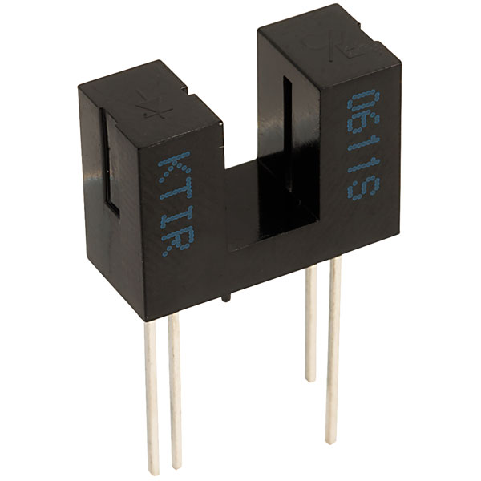
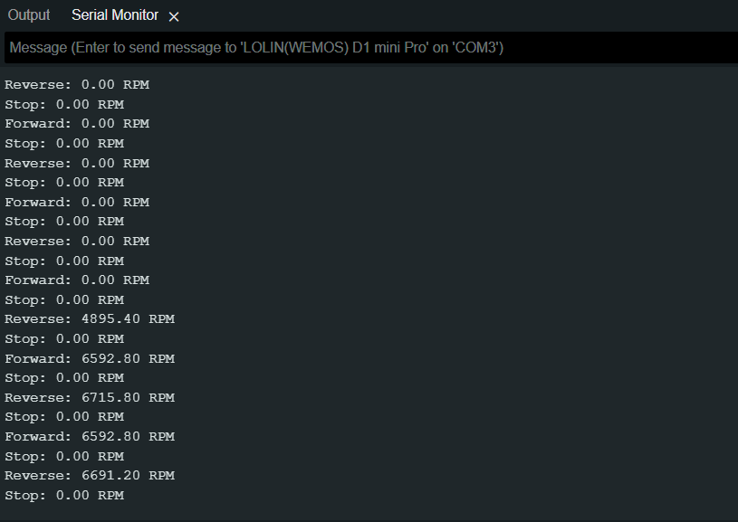

# Photo Interrupter

The KTIR6011S is an infrared emitter and phototransistor pair enclosed in a single package. This type of device is commonly used for reflective object sensing, proximity sensing, and encoder applications for instance ot monitor the motors speed by counting the interrupts in via the spokes of a wheel.

In order to understand the this component it is important to review the supporting technical documentation: 

- [KTIR0611S Photo Interrupter Datasheet](../../Data_Sheets/ktir0611s.pdf)
- [LM2917 Frequency to Voltage Converter](../../Data_Sheets/lm2917-n.pdf)

<div align=center>



</div>

> **Note:** No external libraries needed for this

## Developing the script

1. Create a new a script call it something meaningful like, `motor_speed.ino`

2. Start by adding the standard header information about the script

    ```cpp
    /*
    * AUTHORS: YOUR NAMES
    * VERSION: 1.0.0
    * NOTES: 
    *      - Motor Speed is calculated using the Ktir0611s Photo Interrupter
    *      - Motor will go forward, reverse and then stop in a loop and 
    *        show speed in RPM
    */
    ```

    > **Note:** 
    >> - If you see `...` that means that other code is hidden for brevity

3. Next we need to set the global variables needed throughout the script:

    ```cpp
    ...

    // set variables 
    const int noise_threshold = 20;
    const float motor_speed_conversion_factor = 24.6;
    float motor_speed;
    ```

4. Now we can sort of the setup block so that we permentatly set the mux to the right channel and baudrate for the Serial:
    
    ```cpp
    ...
    void setup(){
      // initialise the serial
      Serial.begin(9600);
      
      pinMode(D0, OUTPUT);  //PWM
      pinMode(D3, OUTPUT);  //Mux A
      pinMode(D4, OUTPUT);  //Mux B
      pinMode(D5, OUTPUT);  //Direction
      pinMode(A0, INPUT);   //Analogue input

      //Motor speed reading
      digitalWrite(D3, LOW);
      digitalWrite(D4, LOW);
    }
    ``` 

5. Penultimately we are going to fill the void loop with the core functionality of programme:

    > **Note:** we will write the `calculateSpeed()` after this step.

    ```cpp
    ...
    void loop(){

      digitalWrite(D5, LOW);  // Motor Forward
      analogWrite(D0, 500);   // you change the speed here
      delay(1000);
      calculateSpeed("Forward");
      

      digitalWrite(D0, LOW);  // Motor Stop
      analogWrite(D5, LOW);
      delay(1000);
      calculateSpeed("Stop");  


      digitalWrite(D0, LOW);  // Motor Reverse
      analogWrite(D5, 500);   // you change the speed here
      delay(1000);
      calculateSpeed("Reverse");
    

      digitalWrite(D0, LOW);  // Motor Stop
      analogWrite(D5, LOW);
      delay(1000);
      calculateSpeed("Stop");  
    }
    ```

6. Finally, we can add write the bit of code tha calcualtes the motor speed based on the number of... 

    ```cpp
    void calculateSpeed(){
        // read 
        motor_speed = analogRead(A0);
        delay(500);

            //Eliminate analogue input noise give motor chance to slow down/speed up
        if (motor_speed < noise_threshold) {
            motor_speed = 0;
        }

        //Calibrate motor speed
        motor_speed = motor_speed * motor_speed_conversion_factor;
        Serial.print(motor_speed);
        Serial.println(" RPM");
    }
    ```

    - The `motor_speed_conversion_factor` value of 24.6 is the result of a the LM2917 (U4) frequency to voltage converter. The converter ouptsa  voltage that is proportional to the input frequency and is scaled by the value 24.6 to the the rpm.

7. If you run the code you should see the following output: 

  

8.  Try experimenting with the motor speed via the `anologWrite()` function: 
    - `analogWrite(D5, 500);`, where 500 is the DAC value that will map to 1.7v 
      - 0v - 3.2v map to 0 to 1024 DAC value

-------------------------------

## Full code below

<details>
<summary>Click here:</summary>

```cpp
/*
* AUTHORS: YOUR NAMES
* VERSION: 1.0.0
* NOTES: 
*      - Motor Speed is calculated using the Ktir0611s Photo Interrupter
*      - Motor will go forward, reverse and then stop in a loop and show speed in RPM
*/

// set variables 
const int noise_threshold = 20;
const float motor_speed_conversion_factor = 24.6;
float motor_speed;

void setup(){
  // initialise the serial
  Serial.begin(9600);
  
  pinMode(D0, OUTPUT);  //PWM
  pinMode(D3, OUTPUT);  //Mux A
  pinMode(D4, OUTPUT);  //Mux B
  pinMode(D5, OUTPUT);  //Direction
  pinMode(A0, INPUT);   //Analogue input

  //Motor speed reading
  digitalWrite(D3, LOW);
  digitalWrite(D4, LOW);

}

void loop(){

  digitalWrite(D5, LOW);  // Motor Forward
  analogWrite(D0, 500);   // you change the speed here
  delay(1000);
  calculateSpeed("Forward");
  

  digitalWrite(D0, LOW);  // Motor Stop
  analogWrite(D5, LOW);
  delay(1000);
  calculateSpeed("Stop");  


  digitalWrite(D0, LOW);  // Motor Reverse
  analogWrite(D5, 500);   // you change the speed here
  delay(1000);
  calculateSpeed("Reverse");
 

  digitalWrite(D0, LOW);  // Motor Stop
  analogWrite(D5, LOW);
  delay(1000);
  calculateSpeed("Stop");  
}

void calculateSpeed(String state){
  // read 
  motor_speed = analogRead(A0);
  delay(500);

  if(motor_speed < noise_threshold){
    motor_speed = 0;
  }

  //Calibrate motor speed
  motor_speed = motor_speed * motor_speed_conversion_factor;
  Serial.print(state);
  Serial.print(": ");
  Serial.print(motor_speed);
  Serial.println(" RPM");
}
```
</details>