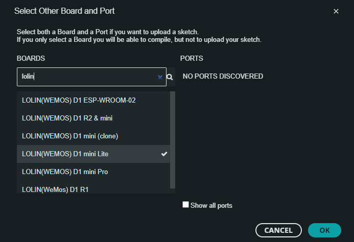

# ESP8266

To be able to upload code the Lionl D1 ESP8266 development board you will need to add the following board libaries to the Arduino Software: 

- Go to:
   -  `File` -> 
      -  `Preferneces` ->
         -   `Additional boards manager URLs` and paste in the following
             -    `https://arduino.esp8266.com/stable/package_esp8266com_index.json`

        

Now you can select the board from the drop down list: 

> **Note:**
>> If you are interested the SDK you have just downloaded comes from the following repository:
>> - [ESP8266 GitHub Repo](https://github.com/esp8266/Arduino/tree/master?tab=readme-ov-file)