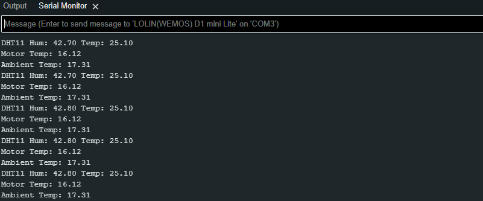

# Temperature

We are going to test the temperature sensors at the same time so we can take adavantage of the MUX at the same time.

In order to understand the this component it is important to review the supporting technical documentation: 

- [TMP35/36 Datasheet](../../Data_Sheets/TMP35_36_37.pdf)

- [DHT11/22 Datasheet](../../Data_Sheets/humidity_sensor.pdf)

Normally we would have to write the code to obtain the information from the components. We need to do that just for the DHT11 component: 

- [DHTesp.h](https://github.com/beegee-tokyo/DHTesp/blob/master/DHTesp.h)

Luckily you can click these links below to download the zips that needed to be addedd to the Arduino Libraries: 

- [DHTesp](https://github.com/beegee-tokyo/DHTesp/archive/refs/heads/master.zip)

Once downloaded, you can use the import function within the Arduino software to unzip the folders into `/path/to/Arduino/Libraries/`, `Sketch` -> `Include Library` -> `Add .Zip Library...`, then navigate to the `/path/to/zipped_library` to include it.

## Developing the script

1. Create a new a script call it something meaningful like, `accelerometer_test.ino`

2. Start by adding the standard header information about the script

    ```cpp
    /*
    * AUTHORS: YOUR NAMES
    * VERSION: 1.0.O
    * NOTES: 
    *      - for testing the 2x TMP36 Temperature sensors 
    *      - and DHT11  Humidity and Temperature sensor
    */
    ```

3.  Using the `#include` directive reference the wire, Adafruit_MMA845, Adafruit_Sensor libraries:

    ```cpp
    ...

    #include <DHTesp.h>
    ```

    > **Note:** 
    >> - If you see `...` that means that other code is hidden for brevity


4. Next we are going to create some global variables that we can reference to perform calculations:

    ```cpp
    ...
    const float voltage_conversion_factor = 0.004;
    const float temperature_conversion_factor = 17.5;
    const float temperature_offset = 20;

    float m_Temp, m_Temp_v, a_Temp, a_Temp_v; // m = motor, a = ambient
    float h ,t; // dht values
    ```

5. Because `cpp` is a obkect orientated programming lanaguage we have the ability to use repeatable templates (*classes*) for code as *objects*. Next we create object of the `DHTesp` class

    ```cpp
    ...

    DHTesp dht;
    ```

6. Next we need to add the following code to inside the `void setup(void)`:
   - Set up serial communication
   - Set pin modes
   - Set up our `dht` objects to communicate with the DHT22 sensor.

    ```cpp
    ...
    void setup(void) {
        dht.setup(D6, DHTesp::DHT22);

        Serial.begin(9600);
        Serial.println("");
        
        //Set up ports
        //D1 and D2 SCL and SCA
        pinMode(D3, OUTPUT);  //Mux A
        pinMode(D4, OUTPUT);  //Mux B
        pinMode(D6, INPUT);   //Humidity
        pinMode(A0, INPUT);   //Analogue input
    }
    ```

7. Next we need to place some code in the `void loop` function to call another function that gets the temperature values

    ```cpp
    ...

    void loop(void) {
        getTemp();
        delay(1000);
    }
    ```

8. Next we can add the `getTemp()` function:

    ```cpp
    void getTemp() {

        //Motor Temp sensor reading
        digitalWrite(D3, HIGH); // Using the MUX to switch sensors
        digitalWrite(D4, LOW);
        m_Temp = analogRead(A0);  //Read Analog Voltage of ADC Pin
        m_Temp_v = m_Temp * voltage_conversion_factor;
        m_Temp = ((temperature_conversion_factor * m_Temp_v) - temperature_offset);
        Serial.print("Motor Temp: ");
        Serial.println(m_Temp);
        delay(200);

        //Amb Temp sensor reading
        digitalWrite(D3, LOW); // Using the MUX to switch sensors
        digitalWrite(D4, HIGH);
        a_Temp = analogRead(A0);  //Read Analog Voltage of ADC Pin
        a_Temp_v = a_Temp * voltage_conversion_factor;
        a_Temp = (temperature_conversion_factor * a_Temp_v) - temperature_offset;
        Serial.print("Ambient Temp: ");
        Serial.println(a_Temp);
        delay(200);

        //Humidity sensor reading
        h = dht.getHumidity();
        t = dht.getTemperature();
        Serial.print("DHT11 Hum: ");
        Serial.print(h);
        Serial.print(" Temp: ");
        Serial.println(t);
        delay(200);
    }
    ```


9. If you run this code you will see the following output:

    


## Full code here

<details>
<summary>Click for full code:</summary>

```cpp
/*
* AUTHORS: YOUR NAMES
* VERSION: 1.0.O
* NOTES: 
*      - for testing the 2x TMP36 Temperature sensors 
*      - and DHT11  Humidity and Temperature sensor
*/

#include <DHTesp.h>

const float voltage_conversion_factor = 0.004;
const float temperature_conversion_factor = 17.5;
const float temperature_offset = 20;

float m_Temp, m_Temp_v, a_Temp, a_Temp_v;
float h ,t;

DHTesp dht;

void setup(void) {
  dht.setup(D6, DHTesp::DHT22);

  Serial.begin(9600);
  Serial.println("");
  
  //Set up ports
  //D1 and D2 SCL and SCA
  pinMode(D3, OUTPUT);  //Mux A
  pinMode(D4, OUTPUT);  //Mux B
  pinMode(D6, INPUT);   //Humidity
  pinMode(A0, INPUT);   //Analogue input
}


void loop(void) {
  getTemp();
  delay(1000);
}


void getTemp() {

  //Motor Temp sensor reading
  digitalWrite(D3, HIGH);
  digitalWrite(D4, LOW);
  m_Temp = analogRead(A0);  //Read Analog Voltage of ADC Pin
  m_Temp_v = m_Temp * voltage_conversion_factor;
  m_Temp = ((temperature_conversion_factor * m_Temp_v) - temperature_offset);
  Serial.print("Motor Temp: ");
  Serial.println(m_Temp);
  delay(200);

  //Amb Temp sensor reading
  digitalWrite(D3, LOW);
  digitalWrite(D4, HIGH);
  a_Temp = analogRead(A0);  //Read Analog Voltage of ADC Pin
  a_Temp_v = a_Temp * voltage_conversion_factor;
  a_Temp = (temperature_conversion_factor * a_Temp_v) - temperature_offset;
  Serial.print("Ambient Temp: ");
  Serial.println(a_Temp);
  delay(200);

  //Humidity sensor reading
  h = dht.getHumidity();
  t = dht.getTemperature();
  Serial.print("DHT11 Hum: ");
  Serial.print(h);
  Serial.print(" Temp: ");
  Serial.println(t);
  delay(200);

}
```

</details>