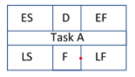
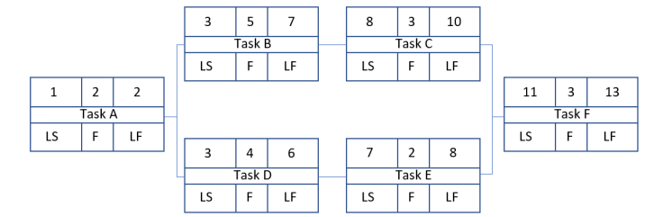
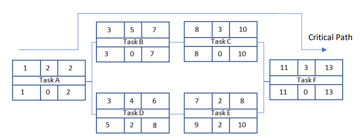

# Project Management and the Critical Path
In order to complete a project successfully, by which we mean it is completed on time and on budget,  it is necessary to do some forward planning. Ideally, we want to break the project down into a number of tasks that can be better managed rather than simply having a single holistic goal. A classic approach  to project management is the critical path method. Using this method the project is decomposed into  smaller tasks. Each task is given an Early Start (ES) time a duration (D), an Early Finish time (EF) and a Late Start (LS) and Late Finish (LF) time. A Float Time (F) is also defined which, as we will see, will highlight any flexibility in the project timeline. Fig. 1 presents the format of the task block:

**Fig. 1** Task block: ES = Early Start, EF = Early Finish, LS = Late Start, LF = Late Finish, D = Duration, F = Float.

The first rule when using this method is to tabulate all of the tasks, durations and any dependencies that may exist. Table 1 presents a simple example of 6 tasks.

|Task |Duration |Dependency|
|---|----|----|
|Plan (A)| 2| -
|Hardware Design (B)| 5| A|
|Hardware Test (C) |3 |B|
|Software Design (D)| 4| A|
|Software Test (E)| 2| D|
|Complete Test (F) |3 |C, E|

Table. 1 Tasks, Duration and Dependencies

The first Task (A) is the project plan which has a duration of 2 days and has no dependencies. Task B is the hardware design phase that has a duration of 5 days and is dependent upon Task (A), the Plan. Task C is the Hardware Test that has a duration of 3 days and is dependent upon completion of the Hardware Design, Task B etc. Task F, the final test of the completed system, is dependent upon completion of both the Hardware Test (C) and Software Test (E).

Using the information in Table. 1, a block diagram, Fig. 2, of the project flow can be drawn and completed with any known information such as the Task Duration. A forward pass is now carried out in order to complete the remaining upper cells in each Task block, ES and EF

**Fig. 2** Block diagram of porject flow

Obviously, the Earliest Start date of Task A is day 1. Since the task has a duration of two days the earliest this task can be completed is on day 2, if we appreciate that work will be carried out on days 1 and 2.

The Early finish can be defined as:

EF = (D + ES) - 1                                       Equation. 1

where D is the task duration and ES is the earliest start date of the task.

Task B must have an Earliest Start date of day 3, the day after the EF date of Task A. Using equation 1, the EF 
date of Task B can be found calculated as 7.

So the earliest finish day for Task B is day 7. The EF day of task C, D, and E can be found in the same way. On reaching Task F a decision needs to be made on what is the earliest start date of this task. Clearly Task F can only  start once both Tasks C and E are complete which implies that Task F must start on day 11. The earliest finish date of Task F is therefore day 13. The project will therefore take 13 days to complete, assuming no delays, and  the critical path consist of Tasks A, B, C and F, which is the longest path through the project block diagram. Any delay in completing these tasks will result in the project being delivered late.

A backwards pass is now carried out in order to complete the lower cells in each project block. Clearly the Late Start and Late Finish times of Task F must be the same as the Early Start and Early Finish times. Working backwords from Task F, the Late Finish times of both Tasks C and E must be day 10. The Late Start times can be determined using equation 2:

LS = (LF− D) + 1                                         Equation. 2

where LS is the latest start time, LF is the latest finish time and D are the duration of the task.

So using equation 2, the latest that Task C can start is day 8 and the latest that Task E can start is day 9 in order  to deliver the project on time. The Late start times of Tasks B and D can be determined in the same way. At Task A, the question arises as to what the Latest Finish date for this Task is. Clearly to meet the late start time of Task B it must finish on day 2 so Task A takes the lower value of Task B and D’s Late Start time in order to determine its Late Finish time. Fig. 3 presents the completed forward and backwards pass project flow diagram.

**Fig. 2**  Completed forward and backward pass project flow diagram

From fig. 3 it is clear that tasks D and E have 2 days of Float. This means that these tasks can be delayed  by up to 2 days and the project can still be delivered on time. The amount of Float can be determined by subtracting the Early Finish time from the Late Finish Time of each task:

F = (LF −EF) Equation. 3

where F is the Task Float and LF and EF are the Late Finish and Early Finish respectively.

Clearly the critical path of Tasks A, B, C and F have zero float as would be anticipated.