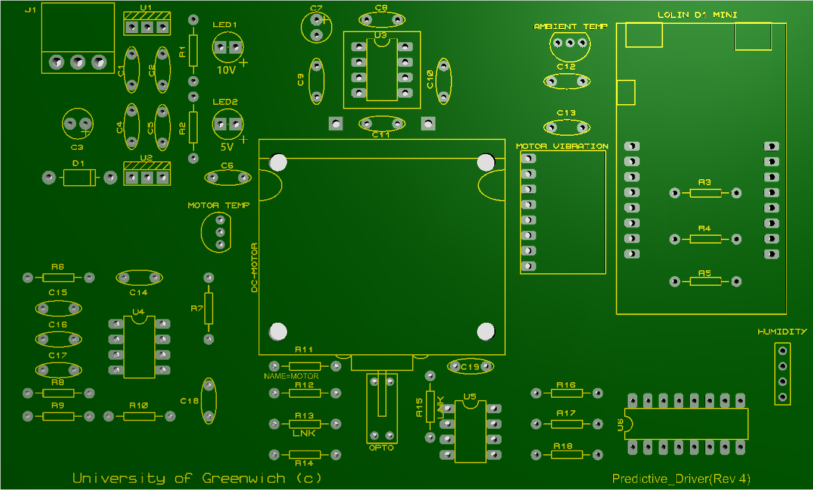

# Soldering Instructions

> **Note:**
>> Do not directly solder in the main components. Use strip connectors supplied.

## Resistors

|Resistors |value |Colour Code|
|---|---|---|
|R1|820R|Gry/Red/Blk/Blk/Brn|
|R2|330R|Org/Org/Blk/Blk/Brn|
|R3/R9|10k|Brn/Blk/Blk/Red/Brn|
|R4/R7/R17/R18|1k|Brn/Blk/Blk/Brn/Brn|
|R5/R10|470|Yel/Vio/Blk/Blk/ Brn|
|R6|220k|Red/Red/Blk/Org/ Brn|
|R8|150k|Brn/Grn/Blk/Org/ Brn|
|R11/R16|2.7k|Red/Vio/Blk/Brn/Brn|
|R12|180R|Brn/Gry/Blk/Blk/ Brn|
|R13/R15|Link|Blk|
|R14|1.5k|Brn/Grn/Blk/Brn/ Brn

## Capacitors

|Capacitors|Value|Code|
|---|---|---|
|C1/C4|0.47uF|474|
|C2/C5-C6/C8-C14C19
|100nF|104|
|C3/C7|100uF|107|
|C15/C17-C18|1uF|105|
|C16|2.2nF|222|
|Use ceramic for1uF||
|Electrolyticfor C3/C7||

## IC's

|IC’s|Value|
|---|---|
|U1|7810|
|U2|7805|
|U3|BD6221|
|U4|LM2917-8|
|U5|AD822|
|U6|74HC4051|
|TMP36|2|
|Humidity|DHT22|

## Other

|Other|Value|
|---|---|
|Diode D1|1N4001|
|LED|3mm x 2|
|Lolin D1|Micro|
|MMA8451|Accel|
|Opto|KTIR611S|
|Motor|DC|
|Motor|Bracket|
|Motor Clips|4|
|Rubber Feet|4|
|Connector|Male (J1)|
|Connector|Female (J1)